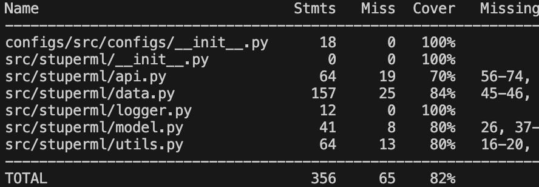
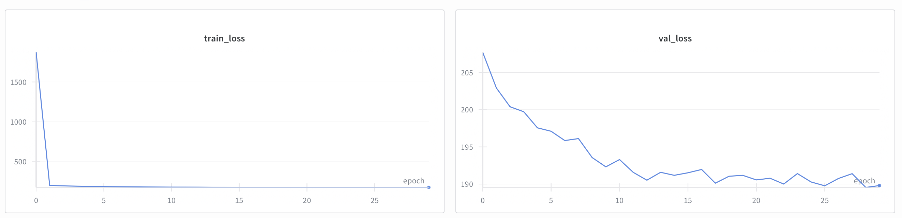
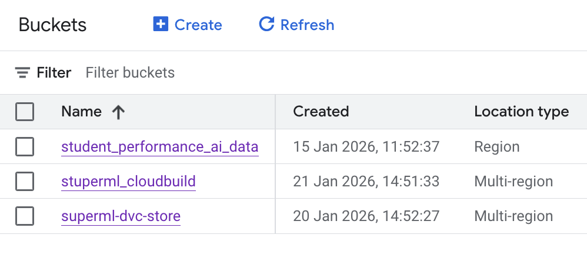
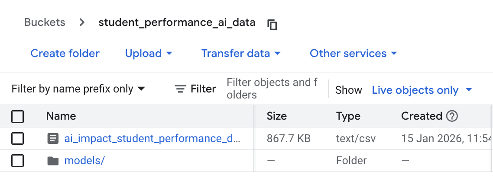
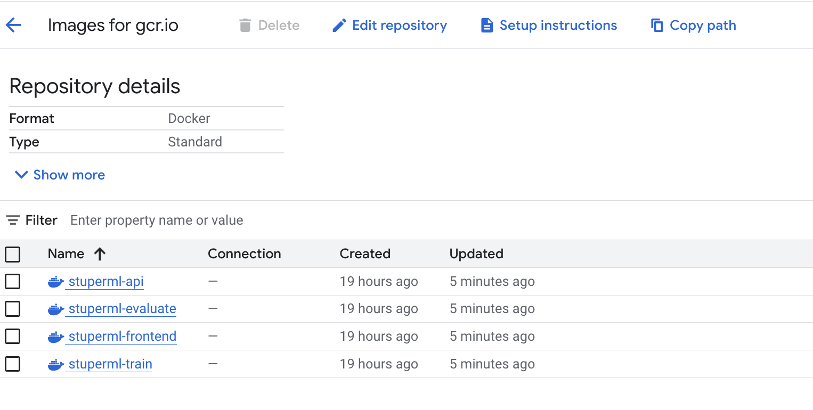
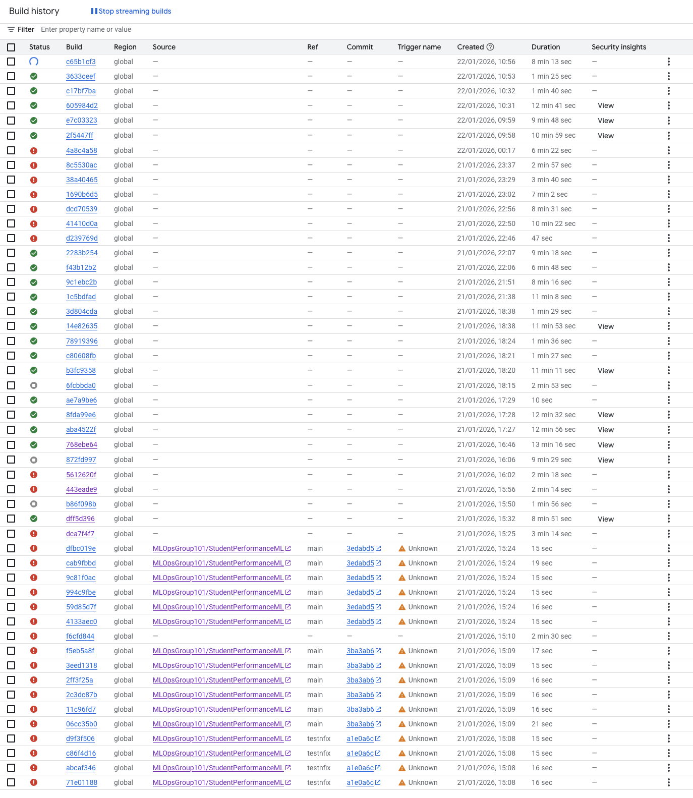

# Exam 02476 Machine Learning Operations

This is the report template for the exam. Please only remove the text formatted as with three dashes in front and behind
like:

```--- question 1 fill here ---```

Where you instead should add your answers. Any other changes may have unwanted consequences when your report is
auto-generated at the end of the course. For questions where you are asked to include images, start by adding the image
to the `figures` subfolder (please only use `.png`, `.jpg` or `.jpeg`) and then add the following code in your answer:

``

In addition to this markdown file, we also provide the `report.py` script that provides two utility functions:

Running:

```bash
python report.py html
```

Will generate a `.html` page of your report. After the deadline for answering this template, we will auto-scrape
everything in this `reports` folder and then use this utility to generate a `.html` page that will be your serve
as your final hand-in.

Running

```bash
python report.py check
```

Will check your answers in this template against the constraints listed for each question e.g. is your answer too
short, too long, or have you included an image when asked. For both functions to work you mustn't rename anything.
The script has two dependencies that can be installed with

```bash
pip install typer markdown
```

or

```bash
uv add typer markdown
```

## Overall project checklist

The checklist is *exhaustive* which means that it includes everything that you could do on the project included in the
curriculum in this course. Therefore, we do not expect at all that you have checked all boxes at the end of the project.
The parenthesis at the end indicates what module the bullet point is related to. Please be honest in your answers, we
will check the repositories and the code to verify your answers.

### Week 1

* [x] Create a git repository (M5)
* [x] Make sure that all team members have write access to the GitHub repository (M5)
* [x] Create a dedicated environment for you project to keep track of your packages (M2)
* [x] Create the initial file structure using cookiecutter with an appropriate template (M6)
* [x] Fill out the `data.py` file such that it downloads whatever data you need and preprocesses it (if necessary) (M6)
* [x] Add a model to `model.py` and a training procedure to `train.py` and get that running (M6)
* [x] Remember to either fill out the `requirements.txt`/`requirements_dev.txt` files or keeping your
    `pyproject.toml`/`uv.lock` up-to-date with whatever dependencies that you are using (M2+M6)
* [x] Remember to comply with good coding practices (`pep8`) while doing the project (M7)
* [x] Do a bit of code typing and remember to document essential parts of your code (M7)
* [x] Setup version control for your data or part of your data (M8)
* [ ] Add command line interfaces and project commands to your code where it makes sense (M9)
* [x] Construct one or multiple docker files for your code (M10)
* [x] Build the docker files locally and make sure they work as intended (M10)
* [x] Write one or multiple configurations files for your experiments (M11)
* [ ] Used Hydra to load the configurations and manage your hyperparameters (M11)
* [ ] Use profiling to optimize your code (M12)
* [x] Use logging to log important events in your code (M14)
* [ ] Use Weights & Biases to log training progress and other important metrics/artifacts in your code (M14)
* [ ] Consider running a hyperparameter optimization sweep (M14)
* [ ] Use PyTorch-lightning (if applicable) to reduce the amount of boilerplate in your code (M15)

### Week 2

* [x] Write unit tests related to the data part of your code (M16)
* [x] Write unit tests related to model construction and or model training (M16)
* [x] Calculate the code coverage (M16)
* [x] Get some continuous integration running on the GitHub repository (M17)
* [x] Add caching and multi-os/python/pytorch testing to your continuous integration (M17)
* [x] Add a linting step to your continuous integration (M17)
* [ ] Add pre-commit hooks to your version control setup (M18)
* [x] Add a continues workflow that triggers when data changes (M19)
* [x] Add a continues workflow that triggers when changes to the model registry is made (M19)
* [x] Create a data storage in GCP Bucket for your data and link this with your data version control setup (M21)
* [x] Create a trigger workflow for automatically building your docker images (M21)
* [x] Get your model training in GCP using either the Engine or Vertex AI (M21)
* [x] Create a FastAPI application that can do inference using your model (M22)
* [x] Deploy your model in GCP using either Functions or Run as the backend (M23)
* [x] Write API tests for your application and setup continues integration for these (M24)
* [ ] Load test your application (M24)
* [ ] Create a more specialized ML-deployment API using either ONNX or BentoML, or both (M25)
* [x] Create a frontend for your API (M26)

### Week 3

* [ ] Check how robust your model is towards data drifting (M27)
* [ ] Setup collection of input-output data from your deployed application (M27)
* [ ] Deploy to the cloud a drift detection API (M27)
* [ ] Instrument your API with a couple of system metrics (M28)
* [ ] Setup cloud monitoring of your instrumented application (M28)
* [x] Create one or more alert systems in GCP to alert you if your app is not behaving correctly (M28)
* [ ] If applicable, optimize the performance of your data loading using distributed data loading (M29)
* [ ] If applicable, optimize the performance of your training pipeline by using distributed training (M30)
* [ ] Play around with quantization, compilation and pruning for you trained models to increase inference speed (M31)

### Extra

* [x] Write some documentation for your application (M32)
* [x] Publish the documentation to GitHub Pages (M32)
* [ ] Revisit your initial project description. Did the project turn out as you wanted?
* [ ] Create an architectural diagram over your MLOps pipeline
* [x] Make sure all group members have an understanding about all parts of the project
* [x] Uploaded all your code to GitHub

## Group information

### Question 1
> **Enter the group number you signed up on <learn.inside.dtu.dk>**
>
> Answer:

Group 101

### Question 2
> **Enter the study number for each member in the group**
>
> Example:
>
> *sXXXXXX, sXXXXXX, sXXXXXX*
>
> Answer:

s224189, s234834, s234859, s234805

### Question 3
> **Did you end up using any open-source frameworks/packages not covered in the course during your project? If so**
> **which did you use and how did they help you complete the project?**
>
> Recommended answer length: 0-200 words.
>
> Example:
> *We used the third-party framework ... in our project. We used functionality ... and functionality ... from the*
> *package to do ... and ... in our project*.
>
> Answer:

--- question 3 fill here ---

## Coding environment

> In the following section we are interested in learning more about you local development environment. This includes
> how you managed dependencies, the structure of your code and how you managed code quality.

### Question 4

> **Explain how you managed dependencies in your project? Explain the process a new team member would have to go**
> **through to get an exact copy of your environment.**
>
> Recommended answer length: 100-200 words
>
> Example:
> *We used ... for managing our dependencies. The list of dependencies was auto-generated using ... . To get a*
> *complete copy of our development environment, one would have to run the following commands*
>
> Answer:

Dependencies are managed with `uv` and a single `pyproject.toml` plus `uv.lock`at the project root. 

A new team member would:

1. Install `uv`
2. Clone the repository
3. Run `uv sync`to create a virtual environment and install exactly the versions pinned.


### Question 5

> **We expect that you initialized your project using the cookiecutter template. Explain the overall structure of your**
> **code. What did you fill out? Did you deviate from the template in some way?**
>
> Recommended answer length: 100-200 words
>
> Example:
> *From the cookiecutter template we have filled out the ... , ... and ... folder. We have removed the ... folder*
> *because we did not use any ... in our project. We have added an ... folder that contains ... for running our*
> *experiments.*
>
> Answer:

The project follows the cookiecutter structure but with adaptations. The main code lives in `src/stuperml` (API, data, model, train, evaluate, utils, visualize, logger). Tests are in `tests` and mirror the main modules. We added multiple Dockerfiles in `dockerfiles` (for training, evaluation, API and frontend), and a `frontend` folder with a Streamlit UI. Instead of `requirements.txt`we rely fully on `pyproject.toml`and `uv.lock` for dependency management. Documentation is configured via `mkdocs.yml.`


### Question 6

> **Did you implement any rules for code quality and format? What about typing and documentation? Additionally,**
> **explain with your own words why these concepts matters in larger projects.**
>
> Recommended answer length: 100-200 words.
>
> Example:
> *We used ... for linting and ... for formatting. We also used ... for typing and ... for documentation. These*
> *concepts are important in larger projects because ... . For example, typing ...*
>
> Answer:

We use linting and formatting to ensure our code is structured correctly, which is directly incorporated into our GitHub Actions (see Question 11) whenever new code is merged into the main branch. We use ruff check and ruff format to enforce these rules. When writing code, we use Pylance to help us correct any type errors in real time. For all major functions and classes, type hinting is required, which forces the developer to think carefully about what types a function takes in and what it outputs.

This is especially important for larger projects where the same code is used multiple times when imported as modules. Since Python is a dynamically typed language, keeping strict type hinting is a good way to keep the project structured. This makes the code much easier to debug when an unexpected type is passed through a class or function.

## Version control

> In the following section we are interested in how version control was used in your project during development to
> corporate and increase the quality of your code.

### Question 7

> **How many tests did you implement and what are they testing in your code?**
>
> Recommended answer length: 50-100 words.
>
> Example:
> *In total we have implemented X tests. Primarily we are testing ... and ... as these the most critical parts of our*
> *application but also ... .*
>
> Answer:

As seen in the `tests` folder, there is 12 pytests: 3 in `test_data.py`(data, preprocessing loading and `main`), 3 in `test_model.py`(SimpleML output, shape and gradient flow, and MeanBaseModel logic) and 6 in `test_utils.py`(split validation, splitting behavior, preprocessor construction, and tensor conversion). These mainly cover the data pipeline, preprocessing utilities and the core model behavior, which are the most critical pieces for correctness and training stability.


### Question 8

> **What is the total code coverage (in percentage) of your code? If your code had a code coverage of 100% (or close**
> **to), would you still trust it to be error free? Explain you reasoning.**
>
> Recommended answer length: 100-200 words.
>
> Example:
> *The total code coverage of code is X%, which includes all our source code. We are far from 100% coverage of our **
> *code and even if we were then...*
>
> Answer:

When testing the code coverage we get the following table:



The total code coverage of our code is 82%, which includes all our source code. We are not super far from 100% coverage of the code that we test. It is important to notice that train.py and evaluate.py are not tested. This was done on purpose since it would not make sense to train the whole model during testing. Instead, we test all the modules going into train.py to make sure they work before the training script runs.

Even if we reached 100% coverage, I still would not trust the code to be completely error-free. High coverage only means that every line of code was executed at least once during the tests, but it does not prove the logic is correct or that all edge cases were handled. A test can run a line of code without actually checking if the result is right for every possible input or handling unexpected data properly. Therefore, while coverage is a useful metric to find untested parts of the code, it doesn't guarantee that the software is bug-free.

### Question 9

> **Did you workflow include using branches and pull requests? If yes, explain how. If not, explain how branches and**
> **pull request can help improve version control.**
>
> Recommended answer length: 100-200 words.
>
> Example:
> *We made use of both branches and PRs in our project. In our group, each member had an branch that they worked on in*
> *addition to the main branch. To merge code we ...*
>
> Answer:

Yes, our workflow included using branches and pull requests. We used the GitHub project board feature to create tasks based on the course exercises, checklist, and our learnings. Group members assigned themselves to tasks and created a separate branch for each task to ensure changes were isolated from the main branch. This allowed multiple members to work in parallel without causing conflicts.

Once a task was completed, the group member pushed and committed their changes to the repository, which automatically created a pull request. About half of the group members used the GitHub web UI and the Fork feature to make commits and manage their changes. Another group member then reviewed the pull request, providing feedback if necessary and checking that the changes met the project requirements. After approval, the branch was merged into the main branch.

Using branches and pull requests improved our version control by keeping the main branch stable, enabling code reviews, and making it easy to track changes and contributions from each group member.


### Question 10

> **Did you use DVC for managing data in your project? If yes, then how did it improve your project to have version**
> **control of your data. If no, explain a case where it would be beneficial to have version control of your data.**
>
> Recommended answer length: 100-200 words.
>
> Example:
> *We did make use of DVC in the following way: ... . In the end it helped us in ... for controlling ... part of our*
> *pipeline*
>
> Answer:

To ensure full reproducibility, we used DVC to track every file influencing our model and datasets. Rather than manually running `data.py` to get the data, we standardized the process using `uv run dvc pull` to fetch the required versions.
During model development, we conducted experiments by varying the feature columns included in our training sets. This exploration was done to understand how different columns influenced the model performance and preprocessing requirements. DVC helped us to log and compare these versions.

We also integrated this with GitHub Actions to automate our CI/CD pipeline. The workflow triggers whenever code changes affect the data or model, automatically generating a report of the modifications. This provided us with an overview of how the changes to the data. 

DVC was hosted on Google Cloud using a GCS bucket and worked fine when running commands locally. We tried to deploy this on Google Cloud with Docker but faced issues after many trials. We eventually could not get the Docker deployment to work as intended.


### Question 11

> **Discuss you continuous integration setup. What kind of continuous integration are you running (unittesting,**
> **linting, etc.)? Do you test multiple operating systems, Python  version etc. Do you make use of caching? Feel free**
> **to insert a link to one of your GitHub actions workflow.**
>
> Recommended answer length: 200-300 words.
>
> Example:
> *We have organized our continuous integration into 3 separate files: one for doing ..., one for running ... testing*
> *and one for running ... . In particular for our ..., we used ... .An example of a triggered workflow can be seen*
> *here: <weblink>*
>
> Answer:

In our project, we had four .yaml files responsible for our continuous integration:

* .github/workflows/deploy.yaml
* .github/workflows/dvc_data_check.yaml
* .github/workflows/linting.yaml
* .github/workflows/tests.yaml

An example can be see here: [example](https://github.com/MLOpsGroup101/StudentPerformanceML/blob/main/.github/workflows/tests.yaml)
This `tests.yaml` workflow triggered when we created a pull request or merged into main. This workflow was responsible for running all the tests in the `.test` folder, which ensured that all main scripts still worked when new implementations were added to the repository. The code was tested on two different operating systems, macos-latest and ubuntu-latest, since most development was on macOS while cloud deployment used Ubuntu. We also tested with Python 3.12 and 3.13. Caching was used to decrease the amount of time spent spinning up the VMs in Actions. We also made sure that this workflow must pass before merging the code into main. The test covered most of the scripts, but did not include scripts such as the train.py since it would be uneccesary to test and re-train a new model everytime new and small changes was done. 

`linting.yaml` was responsible for checking ruff check and ruff format to ensure good code structure and automate format checks. `dvc_data_check.yaml` only triggered when changes were made to code affecting the data or model. `deploy.yaml` triggered for each pull request and merge into main to create the docker images and deploy the containers in the cloud.


## Running code and tracking experiments

> In the following section we are interested in learning more about the experimental setup for running your code and
> especially the reproducibility of your experiments.

### Question 12

> **How did you configure experiments? Did you make use of config files? Explain with coding examples of how you would**
> **run a experiment.**
>
> Recommended answer length: 50-100 words.
>
> Example:
> *We used a simple argparser, that worked in the following way: Python  my_script.py --lr 1e-3 --batch_size 25*
>
> Answer:

We used a centralized configuration system built with Python dataclasses to manage our experiment parameters. By defining a DataConfig class, we ensured that all models and data pipelines received consistent input parameters, such as file paths, seed values, and GCS bucket URIs. This prevented manual errors and ensured reproducibility across different environments. To run an experiment, we would alter the configs/src/configs/__init__.py class and then run the experiment.

```
@dataclass(frozen=True)
class DataConfig:
    """Configuration for data loading and preprocessing."""

    data_folder: Path = Path("data/")
    gcs_uri: str | None = "gs://student_performance_ai_data/"
    gcs_data: str = "ai_impact_student_performance_dataset.csv"
    gcs_service_account_key: str | None = os.getenv("GCS_SA_KEY_PATH", "stuperml-e4e7c60b7b19.json")
    target_col: str = "final_score"
    file_names: tuple[str, ...] = ("X_train.pt", "X_val.pt", "X_test.pt", "y_train.pt", "y_val.pt", "y_test.pt")
    dropped_columns: list[str] = field(default_factory=lambda: [...])
    train_size: float = 0.8
    test_size: float = 0.1
    val_size: float = 0.1
    seed: int = 42

data_config = DataConfig()
```
We would then in train.py and data.py import it and use the attributes:
```
from configs import data_config
```

### Question 13

> **Reproducibility of experiments are important. Related to the last question, how did you secure that no information**
> **is lost when running experiments and that your experiments are reproducible?**
>
> Recommended answer length: 100-200 words.
>
> Example:
> *We made use of config files. Whenever an experiment is run the following happens: ... . To reproduce an experiment*
> *one would have to do ...*
>
> Answer:

We ensured reproducibility by using DVC to track our data and model versions. This allowed us to pull the exact dataset needed for any specific run. For the experiment parameters, we relied on the `DataConfig` class, but these inputs were only saved through Git commits.

This could be improved by using dedicated configuration files for each experiment. Instead of keeping parameters in the code, we could store them in external files like YAML. This would make it easier to track and reproduce different experiments without having to look through the Git history for specific changes.

### Question 14

> **Upload 1 to 3 screenshots that show the experiments that you have done in W&B (or another experiment tracking**
> **service of your choice). This may include loss graphs, logged images, hyperparameter sweeps etc. You can take**
> **inspiration from [this figure](figures/wandb.png). Explain what metrics you are tracking and why they are**
> **important.**
>
> Recommended answer length: 200-300 words + 1 to 3 screenshots.
>
> Example:
> *As seen in the first image when have tracked ... and ... which both inform us about ... in our experiments.*
> *As seen in the second image we are also tracking ... and ...*
>
> Answer:

As seen in the attached screenshot, we tracked training loss, validation loss, and epochs.



The Training Loss measures the Mean Squared Error on the training data after each epoch. This metric is fundamental as it quantifies how well the neural network is learning to map the input features (study habits, AI usage) to the target variable (student grades). The graph demonstrates a sharp decline in the first epoch, dropping from a loss of over 1800 to roughly 200. This rapid convergence indicates that the model architecture and learning rate are well-suited for the data, allowing the optimizer to quickly find a good set of weights.

The Validation Loss tracks the model's performance on a separate dataset that was held back during training. We track this to monitor for overfitting. It's common for a model to memorize training data, leading to low training loss but poor performance on new data. By comparing these two graphs, we can assess generalization. Since the validation loss trends downwards (from ~208 to ~190) and stabilizes alongside the training loss, we can confirm the model is generalizing well to unseen students.

We specifically chose MSE as our metric because this is a regression task. MSE is important because it penalizes large prediction errors more heavily than small ones, ensuring the model avoids making drastic mistakes in grade prediction. These metrics collectively inform us that 30 epochs were sufficient for the model to converge without overfitting.

### Question 15

> **Docker is an important tool for creating containerized applications. Explain how you used docker in your**
> **experiments/project? Include how you would run your docker images and include a link to one of your docker files.**
>
> Recommended answer length: 100-200 words.
>
> Example:
> *For our project we developed several images: one for training, inference and deployment. For example to run the*
> *training docker image: `docker run trainer:latest lr=1e-3 batch_size=64`. Link to docker file: <weblink>*
>
> Answer:

For our project, we developed several Docker images. Each stage of the project was containerized using separate Docker images, including training, evaluation, inference, and the frontend. All Docker images were based on the lightweight `ghcr.io/astral-sh/uv:python3.13-bookworm-slim base image`.

To, for example, build the training image, the following command was used:

```bash 
docker build -f dockerfiles/train.dockerfile -t stuperml-train'
```

We ran the containers using volume mounts to persist artifacts, such as trained models and generated figures, from the container back to the host machine. This was done using the following command (where parameters such as learning rate and number of epochs could also be adjusted):

```bash
docker run -v $(pwd)/models:/app/models stuperml-train
```


The configuration of the train.dockerfile can be viewed here: [GitHub live preview](https://github.com/MLOpsGroup101/StudentPerformanceML/blob/7e8a05977ae496e252b2c0b97ed934ae2b56e5ec/dockerfiles/train.dockerfile)

After local testing, all containers were easily deployable on Google Cloud Platform (GCP). For the API and frontend, the containers were configured to listen on port 8080 to support deployment on Cloud Run.

### Question 16

> **When running into bugs while trying to run your experiments, how did you perform debugging? Additionally, did you**
> **try to profile your code or do you think it is already perfect?**
>
> Recommended answer length: 100-200 words.
>
> Example:
> *Debugging method was dependent on group member. Some just used ... and others used ... . We did a single profiling*
> *run of our main code at some point that showed ...*
>
> Answer:

--- question 16 fill here ---

## Working in the cloud

> In the following section we would like to know more about your experience when developing in the cloud.

### Question 17

> **List all the GCP services that you made use of in your project and shortly explain what each service does?**
>
> Recommended answer length: 50-200 words.
>
> Example:
> *We used the following two services: Engine and Bucket. Engine is used for... and Bucket is used for...*
>
> Answer:


- Cloud Logging: Used to view logs from builds and the running API.
- Cloud Run: Used to deploy the API container and serve predictions.
- VM Manager: Used to manage virtual machines that ran some container builds.
- Cloud Build: Used to build Docker images directly from our repository.
- Cloud Storage: Used to store the dataset and save model artifacts.
- Vertex AI: Used to run training jobs for the model.
- Networking: Used to manage basic connectivity and firewall rules between services.
- Artifact Registry: Used to store and distribute Docker images for deployment.
- Container Registry Vulnerability Scanning: Used to scan Docker images for vulnerabilities (the results were not actively acted upon).
- Compute Engine: Used to run scripts and experiments on virtual machines when needed.


### Question 18

> **The backbone of GCP is the Compute engine. Explained how you made use of this service and what type of VMs**
> **you used?**
>
> Recommended answer length: 100-200 words.
>
> Example:
> *We used the compute engine to run our ... . We used instances with the following hardware: ... and we started the*
> *using a custom container: ...*
>
> Answer:

We used Compute Engine to run heavier jobs that did not fit neatly into serverless services, mainly for building and testing containers. We created virtual machine (VM) instances on demand, installed dependencies using `uv`, and ran the same training and preprocessing scripts as in local development. The VMs were also useful when we needed to pull data from Cloud Storage, train models, and push artifacts back for deployment.

For hardware, we used standard CPU-based VMs (for example, `e2-standard` or similar instance types), as our model is lightweight and does not require GPUs. The VMs were spun up only when needed and shut down afterward to avoid unnecessary costs. Depending on the task, we ran our code either directly on the VM or inside a Docker container built from our project image.

### Question 19

> **Insert 1-2 images of your GCP bucket, such that we can see what data you have stored in it.**
> **You can take inspiration from [this figure](figures/bucket.png).**
>
> Answer:







### Question 20

> **Upload 1-2 images of your GCP artifact registry, such that we can see the different docker images that you have**
> **stored. You can take inspiration from [this figure](figures/registry.png).**
>
> Answer:




### Question 21

> **Upload 1-2 images of your GCP cloud build history, so we can see the history of the images that have been build in**
> **your project. You can take inspiration from [this figure](figures/build.png).**
>
> Answer:



### Question 22

> **Did you manage to train your model in the cloud using either the Engine or Vertex AI? If yes, explain how you did**
> **it. If not, describe why.**
>
> Recommended answer length: 100-200 words.
>
> Example:
> *We managed to train our model in the cloud using the Engine. We did this by ... . The reason we choose the Engine*
> *was because ...*
>
> Answer:

We did manage to train the model in the cloud. We used a manual GitHub Actions trigger that runs Cloud Build, which in turn launches a Vertex AI custom training job with our training container. We intentionally kept it manual (not tied to file changes) so we could control when training jobs ran and avoid accidental cloud costs. Vertex AI handled provisioning and running the container, and the training script saved the model artifacts to our Cloud Storage bucket under models/. We chose this setup because it gave us controlled training (no booming costs) while still letting us run our own Docker-based training code.

## Deployment

### Question 23

> **Did you manage to write an API for your model? If yes, explain how you did it and if you did anything special. If**
> **not, explain how you would do it.**
>
> Recommended answer length: 100-200 words.
>
> Example:
> *We did manage to write an API for our model. We used FastAPI to do this. We did this by ... . We also added ...*
> *to the API to make it more ...*
>
> Answer:

We did manage to write an API for our model using FastAPI. The API loads the trained PyTorch model and the saved preprocessing pipeline on startup, then exposes a /predict endpoint that accepts a list of rows as JSON. Each request is converted into a DataFrame, run through the same preprocessor used during training, and then passed into the model for inference. This keeps inference consistent with training and avoids feature mismatch issues. We also added a simple health check endpoint so we can verify the service is up. For deployment, the API runs inside a Docker container and runs through Cloud Run.


### Question 24

> **Did you manage to deploy your API, either in locally or cloud? If not, describe why. If yes, describe how and**
> **preferably how you invoke your deployed service?**
>
> Recommended answer length: 100-200 words.
>
> Example:
> *For deployment we wrapped our model into application using ... . We first tried locally serving the model, which*
> *worked. Afterwards we deployed it in the cloud, using ... . To invoke the service an user would call*
> *`curl -X POST -F "file=@file.json"<weburl>`*
>
> Answer:

We deployed the API both locally and in the cloud. Locally, we run it with `uv run uvicorn src.stuperml.api:app --reload` and send requests to [localhost](http://localhost:8000/predict). For cloud deployment, we containerized the API and deployed it to Cloud Run, which handles scaling and HTTPS endpoints. The container includes the model and preprocessor artifacts, and the service is invoked by sending a POST request with JSON data.

This setup lets us test quickly on local machines and then use the same build for cloud setup.

### Question 25

> **Did you perform any unit testing and load testing of your API? If yes, explain how you did it and what results for**
> **the load testing did you get. If not, explain how you would do it.**
>
> Recommended answer length: 100-200 words.
>
> Example:
> *For unit testing we used ... and for load testing we used ... . The results of the load testing showed that ...*
> *before the service crashed.*
>
> Answer:

We did unit tests with pytest and FastAPI’s TestClient. We mocked the model so the tests only check that the endpoints respond and the prediction output format is correct. We didn’t run any load testing. If we had time, we would use Locust or k6 to send lots of concurrent requests to /predict and measure response time, error rate, and how many requests the service can handle before slowing down or failing. That would help us decide whether to scale the service or change settings in Cloud Run.

### Question 26

> **Did you manage to implement monitoring of your deployed model? If yes, explain how it works. If not, explain how**
> **monitoring would help the longevity of your application.**
>
> Recommended answer length: 100-200 words.
>
> Example:
> *We did not manage to implement monitoring. We would like to have monitoring implemented such that over time we could*
> *measure ... and ... that would inform us about this ... behaviour of our application.*
>
> Answer:

We did not implement full model monitoring. We can see basic service health through Cloud Logging (errors, request volumes, latency), but we did not add drift detection, performance tracking, or automated alerts tied to model quality. If we had monitoring, we’d track input feature distributions over time, prediction distributions, and a small set of ground‑truth outcomes when available. That would let us detect data drift, degraded accuracy, or unexpected behavior and retrain the model before it impacts users. A big part of why we didn't, is also because we never optimized our model to be any good.


## Overall discussion of project

> In the following section we would like you to think about the general structure of your project.

### Question 27

> **How many credits did you end up using during the project and what service was most expensive? In general what do**
> **you think about working in the cloud?**
>
> Recommended answer length: 100-200 words.
>
> Example:
> *Group member 1 used ..., Group member 2 used ..., in total ... credits was spend during development. The service*
> *costing the most was ... due to ... . Working in the cloud was ...*
>
> Answer:


We spent a total of around 250 DKK. This was quite a jump from the last time, which was mainly caused by "Container Registry Vulnerability Scanning", because we built around 20x of our docker images for bug fixing. Looking back, not the best money decision. Luckily, it was free money.

Our experience with working in Google Cloud was okay. We believe that all cloud services are probably pretty annoying to use, and there is a lot of info online on how to use google's (like the youtube videos). A lot of the problems we had, like reading the log of docker builds, had issues because we didn't know where to look, (for docker, we didn't look at the actual terminal log at first, so we didn't know it was a problem with our own build not having the correct subfolders etc.)


### Question 28

> **Did you implement anything extra in your project that is not covered by other questions? Maybe you implemented**
> **a frontend for your API, use extra version control features, a drift detection service, a kubernetes cluster etc.**
> **If yes, explain what you did and why.**
>
> Recommended answer length: 0-200 words.
>
> Example:
> *We implemented a frontend for our API. We did this because we wanted to show the user ... . The frontend was*
> *implemented using ...*
>
> Answer:

--- question 28 fill here ---


We added a Frontend: a seperate Streamlit app, that calls the Cloud Run API and visualizes predictions for end-users.


### Question 29

> **Include a figure that describes the overall architecture of your system and what services that you make use of.**
> **You can take inspiration from [this figure](figures/overview.png). Additionally, in your own words, explain the**
> **overall steps in figure.**
>
> Recommended answer length: 200-400 words
>
> Example:
>
> *The starting point of the diagram is our local setup, where we integrated ... and ... and ... into our code.*
> *Whenever we commit code and push to GitHub, it auto triggers ... and ... . From there the diagram shows ...*
>
> Answer:

--- question 29 fill here ---

### Question 30

> **Discuss the overall struggles of the project. Where did you spend most time and what did you do to overcome these**
> **challenges?**
>
> Recommended answer length: 200-400 words.
>
> Example:
> *The biggest challenges in the project was using ... tool to do ... . The reason for this was ...*
>
> Answer:

--- question 30 fill here ---

### Question 31

> **State the individual contributions of each team member. This is required information from DTU, because we need to**
> **make sure all members contributed actively to the project. Additionally, state if/how you have used generative AI**
> **tools in your project.**
>
> Recommended answer length: 50-300 words.
>
> Example:
> *Student sXXXXXX was in charge of developing of setting up the initial cookie cutter project and developing of the*
> *docker containers for training our applications.*
> *Student sXXXXXX was in charge of training our models in the cloud and deploying them afterwards.*
> *All members contributed to code by...*
> *We have used ChatGPT to help debug our code. Additionally, we used GitHub Copilot to help write some of our code.*
> Answer:

Student s234834 was in charge of Docker, Frontend Development, Google Cloud Platform.

Student s224189 was in charge of Logging, Docs, Project Questions

Student s234859 was in charge of Data Version Control (DVC), Unit Testing, Continuous Integration (CI), Model setup.

Student s234805 was in charge of Google Cloud Platform, FastAPI, Data Management.

All group members contributed actively to the codebase by creating branches, committing changes, and submitting pull requests, which were reviewed and merged collaboratively, and all group members were present at all scheduled working days.

We used ChatGPT as a generative AI tool to help explain coding problems, clarify concepts, and provide guidance on how to set up certain tools and configurations during development.